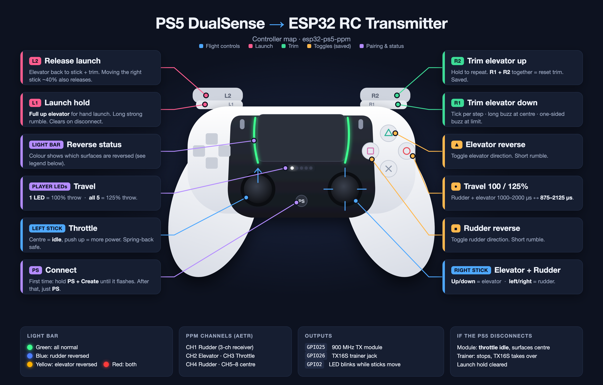

# ESP32 PS5 → PPM

Turns a PS5 DualSense controller into an RC transmitter. An original ESP32 pairs with the controller over Bluetooth (via [Bluepad32](https://github.com/ricardoquesada/bluepad32)) and outputs PPM on two pins at once:

```
DualSense ──Bluetooth──► ESP32 ─┬─PPM (GPIO25)──► 900 MHz TX module ──RF──► receiver ──► servos / ESC
                                └─PPM (GPIO26)──► radio trainer jack (e.g. RadioMaster TX16S)
```



## Hardware

- **Original ESP32** (ESP32-WROOM / DevKit, ESP32-D0WD). The ESP32-C3 and S3 won't work because the DualSense needs Classic Bluetooth.
- **PS5 DualSense** controller
- **PPM transmitter module**, e.g. the 900 MHz "航模900mhz发射模块" simulator-port module (3.5–5.5 V, about 50 mA, PPM input above 1.5 V)
- A matching receiver (tested with a 3-channel receiver)

## Wiring

| TX module pad (component side up, left → right) | ESP32 |
|---|---|
| 1 + VCC | VIN / 5V |
| 2 – GND | GND |
| 3 PPM signal | **GPIO25** |
| 4 GND (signal) | GND (optional) |

Don't power the module from 3V3. That's below its 3.5 V minimum.

### Trainer port (RadioMaster TX16S)

| 3.5 mm plug | ESP32 |
|---|---|
| Tip | **GPIO26** (PPM) |
| Sleeve | GND |

Check the jack pinout in your radio's manual before plugging in. Power the ESP32 separately (for example from a USB power bank), because the trainer jack doesn't supply power.

EdgeTX setup:
1. **Model → Trainer mode: Master/Jack.**
2. **Radio → Trainer:** map TR1–TR4 to the sticks. The output sends TR1 = rudder, TR2 = elevator, TR3 = throttle, TR4 = rudder.
3. Assign a **Special Function: Trainer** to a switch (momentary, latching or ON).

The trainer output only sends while the PS5 is connected (or a serial test mode is on). If the controller drops out, GPIO26 goes quiet, EdgeTX reports **trainer signal lost**, and the radio's own sticks take over. The GPIO25 output keeps running with its failsafe values.

### Diagnostics input

Connect **GPIO27** to GPIO25 or GPIO26 (loopback), or to a receiver's output, to decode PPM. A 5 V receiver output needs a 1–2.2 kΩ series resistor.

## Controls

| PPM channel (Futaba AETR) | Source |
|---|---|
| CH1 Aileron | Right stick X (rudder on a 3-ch receiver) |
| CH2 Elevator | Right stick Y |
| CH3 Throttle | Left stick Y: centre = idle, push up = more throttle |
| CH4 Rudder | Right stick X |
| CH5–8 | Centre (1500 µs) |

| Button | Action |
|---|---|
| Square | Toggle rudder reverse |
| Triangle | Toggle elevator reverse |
| Circle | Toggle rudder + elevator travel 100% (1000–2000 µs) ↔ 125% (875–2125 µs) |
| L1 | **Launch hold:** full up elevator (same as right stick fully back) |
| L2 | Release launch hold (moving the right stick up/down past ~40% also releases it) |
| R1 / R2 | Elevator trim down / up. Hold to repeat, press both to reset |

Reverse settings are saved to flash. The light bar shows the current state: **green** = normal, **blue** = rudder reversed, **yellow** = elevator reversed, **red** = both reversed. Travel is shown on the player LEDs: **1 LED** = 100%, **all 5** = 125%. Each toggle gives a short rumble; switching to 125% gives a longer one.

Launch hold gives a long strong rumble when it engages and is always cleared if the controller disconnects. Trim steps are about 8 µs (±128 µs max). Each step gives a tiny rumble, passing through centre a longer one, and hitting the limit a one-sided buzz. Trim is saved to flash.

The ESP32's built-in LED (GPIO2) blinks while either stick is off-centre.

**Failsafe:** if the controller disconnects, GPIO25 sends throttle idle (1000 µs) with the other channels centred, and keeps running. GPIO26 (trainer) stops sending.

## PPM signal

- 8 channels, 22.5 ms frame, 1000–2000 µs, 300 µs separator
- Inverted (idles high, low pulses), Futaba/trainer-port style
- Generated by the ESP32 RMT peripheral, so pulse widths aren't affected by Bluetooth timing

## Build & flash

```bash
arduino-cli config add board_manager.additional_urls https://raw.githubusercontent.com/ricardoquesada/esp32-arduino-lib-builder/master/bluepad32_files/package_esp32_bluepad32_index.json
arduino-cli core update-index
arduino-cli core install esp32-bluepad32:esp32
arduino-cli compile --fqbn esp32-bluepad32:esp32:esp32 .
arduino-cli upload  --fqbn esp32-bluepad32:esp32:esp32 -p /dev/cu.usbserial-110 .
```

## Pairing

Hold **PS + Create** until the light bar double-flashes. After the first pairing, pressing **PS** reconnects it.

## Serial commands (115200 baud)

| Key | Action |
|---|---|
| `p` | Flip TX module (GPIO25) polarity |
| `P` | Flip trainer (GPIO26) polarity |
| `s` | Separator 300 / 400 µs |
| `t` | Test sweep on CH1–4 (**remove the prop**) |
| `k` | Fixed pattern: 1100, 1300, 1500, 1700, 1900, 1500… |
| `?` | Show settings |

`esp_cmd.py` sends a command and prints the output:

```bash
python3 esp_cmd.py k 3
```

## Configuration

Constants at the top of `esp32_ps5_ppm.ino`: pins, frame timing, default polarity, deadzone, `THROTTLE_FROM_CENTRE` (set to false for full-travel throttle), `REVERSE_THROTTLE`, `HIGH_TRAVEL_PERCENT` (default 125), `LAUNCH_UP_PERCENT`, `LAUNCH_CANCEL`, `TRIM_STEP` and `TRIM_LIMIT`.

## Safety

Always remove the propeller when testing on the bench. Check the transmitter module's frequency and power are legal where you fly.
